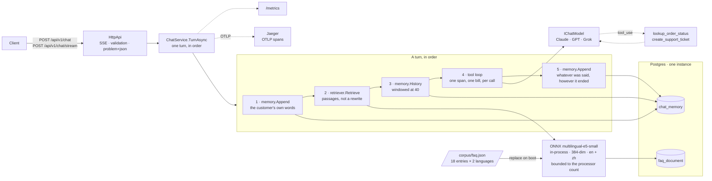

# AI Customer Service System — .NET

[](https://github.com/lai3d/ai-customer-service-dotnet/actions/workflows/ci.yml)
[](LICENSE)
[](https://dotnet.microsoft.com/)

[中文](README.zh.md) · **English**

An AI customer service backend in C# on .NET 10: retrieval-augmented answers over a
bilingual FAQ corpus, tool calling for real business actions, SSE streaming, a
per-conversation token budget, Prometheus metrics and OpenTelemetry traces. The embedding
model runs in this process; the chat model is Anthropic Claude by default, with OpenAI and
xAI selectable by configuration.

**This is the third implementation of a system that already exists
[in Java](https://github.com/lai3d/ai-customer-service-java) and
[in Go](https://github.com/lai3d/ai-customer-service-go).** It is not a port of either. The
three share a corpus, a system prompt, a set of measurements and a method, and nothing else
— and the comparison is the point. Where the numbers differ, all of them are reported. Where
this implementation found a sibling's claim too broad, it says so; where a sibling's method
found a defect here, that is recorded too.

---

## What this project found


| | |
| --- | --- |
| A 250-line C# port of the XLM-RoBERTa tokenizer matches the Rust one on 74 of 74 cases and the Go implementation's retrieval scores to four decimal places — because the fixture came from a different implementation, not from the same understanding | [Retrieval](docs/retrieval.md#in-process-embedding-in-net-no-native-build-and-a-tokenizer-to-write) |
| The token-accounting leak the Java repository blamed on "the abstraction" was one framework's: .NET's own unified chat abstraction keeps the call boundary, measured across three providers before a line of this service was written | [Cost and failure](docs/reliability.md#the-abstraction-leak-was-one-frameworks-and-it-was-measured-before-this-repository-existed) |
| A tool result is prompt: the serializer wrote an enum as `1`, the model said it could not translate a coded status, and every test had read the JSON back through the same serializer | [Tool calling](docs/tools.md#a-tool-result-is-prompt-too-and-the-serializer-did-not-know-that) |
| GPT-5 bills its reasoning as output: 1,325 output tokens for a five-line answer that cost Claude 178 and Grok 101 | [Chat providers](docs/providers.md#what-only-a-live-call-found) |
| The tool span was nested under the model call that asked for it, every test passed, and only the trace tree in Jaeger showed it | [Observability](docs/observability.md#the-tool-span-was-in-the-wrong-place-and-only-the-trace-said-so) |
| The Anthropic SDK's enum `ToString()` keeps the JSON quotes, a loop compared against `tool_use` and stopped after one call, and a table of expected frame counts was what caught it | [Chat providers](docs/providers.md#what-only-a-live-call-found) |
| In-process embedding needs no native build step on .NET — ONNX Runtime ships in a NuGet package — and costs a tokenizer instead | [Retrieval](docs/retrieval.md) |
| The three score populations overlap here exactly as they did in Go, so the threshold is 0 for the same measured reason | [Retrieval](docs/retrieval.md#no-similarity-threshold-is-worth-setting-with-this-model) |

---

## Where the runtime moved the check


The most useful thing about a third implementation is not another latency table. It is
watching the same class of problem land in a different place: compile time, test time, or
production.

| The Java implementation must test that… | Here it is… |
| --- | --- |
| the memory advisor runs before the retrieval advisor, or retrieved passages are written into the customer's history | impossible: retrieval returns passages, and the turn composes the prompt. Memory never sees them. |
| the `query: ` / `passage: ` markers are applied to the right side | impossible: `IEmbedder` has `EmbedQueryAsync` and `EmbedPassagesAsync` and no `Embed`. |
| every path to the model populates `ToolContext`, or ticket creation fails once a conversation escalates | a compile error: the conversation id is a parameter. |
| **The Go implementation must bound that…** | |
| a goroutine blocked in cgo does not multiply OS threads | the same hazard with the opposite default: a thread blocked in ONNX Runtime is a thread-pool thread, and the pool grows slowly on purpose, so a burst starves everything the pool carries. Bounded to the processor count on reasoning, not yet on a measurement. |
| — | **but**: `System.Text.Json` writes enums as integers, and that reached the model as a tool result before any test noticed. |
| — | **but**: two `SessionOptions` types, a quoted enum `ToString()`, an `app` user the base image already had — each a small runtime fact that a compile did not catch. |

Neither runtime is safer. They move the same class of problem to different places.

---

## Architecture




**Why these pieces:**

| Decision | Reason |
| --- | --- |
| ASP.NET Core minimal APIs, `Channel<T>`, `SemaphoreSlim`; no chat framework in the turn | An LLM call is a long asynchronous wait, which is what `async`/`await` is for. The turn is a method whose five statements can be read on one screen, and one `StreamAsync` is one model call is one bill. |
| The official Anthropic and OpenAI SDKs, and nothing between them and the loop | `Microsoft.Extensions.AI` was measured first and keeps the call boundary; it is still a layer between the loop and the wire, and the tool loop here validates a tool name before it can become a metric label. |
| pgvector in the business database | One database to run, back up and reason about. |
| In-process ONNX embeddings, through NuGet | Anthropic has no embedding API. Local means no second vendor, no second key, nothing per query — and on .NET, no native build step. |
| A C# tokenizer checked against a Rust fixture | The .NET tokenizer packages do not read this model's `tokenizer.json`, and a tokenizer that is subtly wrong produces plausible vectors and bad rankings rather than an error. |
| Prices and tokens metered by model, never by conversation | Per-conversation tags grow cardinality without limit and take the metrics backend down long before the bill does. |

---

## Quick start


**Prerequisites:** Docker, and an Anthropic API key. No .NET SDK: `scripts/dotnet.sh` runs
the SDK in its container when `dotnet` is not on the PATH.

```bash
make deps                    # the 470 MB embedding model, once
cp .env.example .env
$EDITOR .env                 # set ANTHROPIC_API_KEY

docker compose up -d         # Postgres 5434, Jaeger 16688, the app on 8082
open http://localhost:8082   # the demo UI
```

Or run the app from source against just the database:

```bash
docker compose up -d postgres jaeger
make run
```

```bash
curl -s localhost:8082/healthz
curl -s localhost:8082/metrics | grep '^chat_'
open http://localhost:16688  # Jaeger: every turn, span by span
```

Ports deliberately avoid the Java and Go implementations', so all three stacks can run on
one machine.

Run the tests — Testcontainers starts its own pgvector, the real embedding model is used
throughout, and nothing reaches a chat API, so **no key is needed**:

```bash
make test
```

---

## API


Both endpoints take the same body. Omit `conversationId` to start a new conversation; the
assigned id comes back in the `X-Conversation-Id` header.

```bash
curl -sS localhost:8082/api/v1/chat \
  -H 'Content-Type: application/json' \
  -d '{"message": "Where is my order ORD-10042?"}' | jq

curl -N localhost:8082/api/v1/chat/stream \
  -H 'Content-Type: application/json' \
  -d '{"conversationId": "abc-123", "message": "And if it was a gift?"}'
```

The stream carries typed events rather than bare tokens — `retrieval`, `tool`, `message`,
`usage`, `error`. A chat widget reads `message` and `error` and ignores the rest; everything
else is there because the interesting part of this system is the part a widget hides.

```
event: retrieval
data: {"type":"retrieval","passages":[{"entryId":"returns-damaged","language":"en","score":0.8114,…}]}

event: tool
data: {"type":"tool","tool":{"name":"lookup_order_status","outcome":"found"}}

event: message
data: {"type":"message","text":"Your order ORD-10042"}

event: usage
data: {"type":"usage","usage":{"model":"claude-opus-5","modelCalls":2,"inputTokens":3656,"outputTokens":261,…}}
```

`retrieval` arrives **before** the model is called, so a client can show it while the model
is still thinking — and so it survives a model call that fails, which is exactly when
someone debugging a bad answer needs it.

### The same request, asked in Chinese

Nothing is configured differently. The corpus is indexed in both languages, so a Chinese
question matches Chinese passages and the answer comes back in Chinese, with the same tool
call and the same accounting behind it.

```bash
curl -sS localhost:8082/api/v1/chat \
  -H 'Content-Type: application/json' \
  -d '{"message": "我的订单 ORD-10042 什么时候到？退货有时间限制吗"}' | jq
```

```
passages   returns-window (zh) · account-order-history (zh) · returns-how (zh)
tools      lookup_order_status → found
usage      2 model calls · 1818/60 + 1998/178 = 3816/238 tokens
reply      你的订单 ORD-10042（1 件降噪耳机）目前状态是**运输中**：
           - 承运商：SingPost · 运单号：SP884213906SG · 预计送达：2026-09-03 …
           关于退货时限：大部分商品在**签收后 30 天内**可退货并全额退款 …
```

Two model calls, because the model asked for the tool and then answered with its result.

---

## Deeper reading


| | |
| --- | --- |
| [Retrieval](docs/retrieval.md) | In-process embedding on .NET, the tokenizer port and its fixture, and why no threshold is worth setting |
| [Cost and failure](docs/reliability.md) | Token accounting per call, the abstraction-leak probe, budgets, timeouts, bounded tool side effects |
| [Chat providers](docs/providers.md) | Anthropic, OpenAI and xAI, and what only a live call found |
| [Tool calling](docs/tools.md) | Why a missing order is a value, why conversation identity is a parameter, and why a tool result is prompt |
| [Observability](docs/observability.md) | GenAI spans over OTLP, the misplaced tool span, and grepping the backend for customer text |
| [Footprint](docs/footprint.md) | What the image and the process cost, and which numbers are not yet comparable |
| [The demo UI](docs/demo-ui.md) | The Go implementation's glass box, shared on purpose |

---

## Status


Verified live against `claude-opus-5`, `gpt-5` and `grok-4.6`, in English and in Chinese:
each answers the order question from the corpus, calls `lookup_order_status` and uses its
result, and reports usage per model call that reaches the budget, the meters and the spans.
Traces arrive in Jaeger with `gen_ai.usage.*` and per-tool spans and carry no customer text,
checked by grepping the backend. Over eighty tests, no API key, real pgvector and the real
embedding model throughout.

**What is not done, stated rather than implied:**

- **No Kubernetes manifests.** Both siblings ship them, verified on kind; this one does not
  yet, and the memory numbers in [Footprint](docs/footprint.md) are labelled accordingly.
- **No benchmark.** The Go implementation measured goroutines against Loom; the equivalent
  question here — what a burst of blocked native calls does to the .NET thread pool — is
  the most interesting one this runtime raises, and it is unmeasured. The embedder is
  bounded on reasoning, not on a number.
- **The demo page is the Go implementation's and has not been driven in a browser here.**
  The wire contract it consumes has been.
- **No Gemini.** Three providers, not four, as in Go.
- **The per-conversation lock and the ticket cap are per process**, as in the siblings.
- **`top-k: 8` is inherited, not re-measured.**
- **No evaluation harness.** The retrieval measurements say which passage was found, not
  whether the answer built from it was good.
- **No dual-target deployment.** The Java implementation can run as one process or as
  `chat`, `knowledge` and `ticket` roles (its ADR 001). This implementation is one process.
- **No admin surface**, for the reason the Go repository gives: it is the same decision as
  authentication, and both are out of scope.

Deliberately out of scope: authentication, multi-tenancy, MCP.

---

## Project layout


```
├── Dockerfile                 # 3 stages; the model baked in, no runtime downloads
├── docker-compose.yml         # Postgres, Jaeger, the app -- ports avoid the siblings'
├── corpus/faq.json            # byte-identical to the Java and Go implementations'
├── scripts/
│   ├── dotnet.sh              # the SDK in a container when none is installed
│   └── fetch-deps.sh          # the honest cost of an in-process model
├── src/CustomerService/
│   ├── Program.cs             # wiring, health, graceful shutdown
│   ├── Chat/                  # a turn, in order: memory, retrieval, the tool loop
│   ├── Config/                # every tunable, with the reasoning next to it
│   ├── Cost/                  # conversation budget and prices
│   ├── HttpApi/               # validation, SSE, problem+json, the embedded demo page
│   ├── Llm/                   # the provider boundary: Anthropic, OpenAI, xAI
│   ├── Obs/                   # metrics and traces
│   ├── Rag/                   # corpus, tokenizer, ONNX embedder, pgvector, retriever
│   ├── Store/                 # data source and schema
│   └── Tools/                 # order lookup, support tickets
└── tests/CustomerService.Tests/
    ├── tokenizer-fixture.json # token ids from the Rust tokenizer, 74 cases
    └── Support/               # the Postgres fixture, the scripted model, the fake provider
```

---

## License


[Apache License 2.0](LICENSE)
