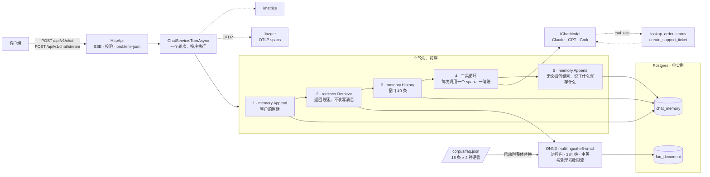

# AI 客服系统 — .NET

[](https://github.com/lai3d/ai-customer-service-dotnet/actions/workflows/ci.yml)
[](LICENSE)
[](https://dotnet.microsoft.com/)

**中文** · [English](README.md)

一个用 C# / .NET 10 写的 AI 客服后端：基于双语 FAQ 语料的检索增强回答、面向真实业务动作的工具调用、SSE
流式输出、按会话的 token 预算、Prometheus 指标和 OpenTelemetry 链路。嵌入模型在本进程内运行；对话模型默认是
Anthropic Claude，可通过配置切换到 OpenAI 或 xAI。

**这是同一个系统的第三个实现**，前两个分别是 [Java](https://github.com/lai3d/ai-customer-service-java) 和
[Go](https://github.com/lai3d/ai-customer-service-go)。它不是移植。三者共享同一份语料、同一段系统提示词、同一套测量和
同一种方法，除此之外各自独立——比较本身就是目的。数字不同时，全部如实报告；本实现发现兄弟仓库的结论过宽时会写明；兄弟仓库的方法在这里找出缺陷时，同样记录。

---

## 这个项目发现了什么


| | |
| --- | --- |
| 250 行的 C# 版 XLM-RoBERTa 分词器，74 组用例与 Rust 实现逐 id 一致，检索得分与 Go 实现精确到小数点后四位——因为对照夹具来自另一个实现，而不是同一份理解 | [检索](docs/retrieval.md#in-process-embedding-in-net-no-native-build-and-a-tokenizer-to-write) |
| Java 仓库归咎于「抽象层」的 token 记账泄漏，其实只属于一个框架：.NET 自己的统一对话抽象保住了调用边界，在本服务写下第一行之前已跨三家提供商量过 | [成本与故障](docs/reliability.md#the-abstraction-leak-was-one-frameworks-and-it-was-measured-before-this-repository-existed) |
| 工具结果也是提示词：序列化器把枚举写成了 `1`，模型说它无法解读编码状态，而所有测试都用同一个序列化器把 JSON 读了回来 | [工具调用](docs/tools.md#a-tool-result-is-prompt-too-and-the-serializer-did-not-know-that) |
| GPT-5 把推理算进输出：一段五行的回答花了 1,325 个输出 token，Claude 是 178，Grok 是 101 | [对话提供商](docs/providers.md#what-only-a-live-call-found) |
| 工具 span 被挂在发起它的模型调用之下，所有测试都通过，只有 Jaeger 里的链路树看得见 | [可观测性](docs/observability.md#the-tool-span-was-in-the-wrong-place-and-only-the-trace-said-so) |
| Anthropic SDK 的枚举 `ToString()` 带着 JSON 引号，循环和 `tool_use` 比较后只跑了一次调用，抓住它的是一张预期帧数表 | [对话提供商](docs/providers.md#what-only-a-live-call-found) |
| .NET 上的进程内嵌入不需要原生构建步骤——ONNX Runtime 随 NuGet 包到位——代价换成了要自己写分词器 | [检索](docs/retrieval.md) |
| 三个得分分布在这里的重叠与 Go 完全一致，所以阈值同样因测量而设为 0 | [检索](docs/retrieval.md#no-similarity-threshold-is-worth-setting-with-this-model) |

---

## 运行时把检查挪到了哪里


第三个实现最有用的地方不是再多一张延迟表，而是看同一类问题落在不同位置：编译期、测试期，还是生产环境。

| Java 实现必须用测试保证…… | 在这里它是…… |
| --- | --- |
| 记忆 advisor 先于检索 advisor 运行，否则检索段落会被写进客户历史 | 不可能发生：检索返回段落，由轮次组装提示词，记忆从不见它们。 |
| `query: ` / `passage: ` 标记加在了正确的一侧 | 不可能发生：`IEmbedder` 只有 `EmbedQueryAsync` 和 `EmbedPassagesAsync`，没有 `Embed`。 |
| 每条到模型的路径都填充了 `ToolContext`，否则会话升级后建单失败 | 编译错误：会话 id 是参数。 |
| **Go 实现必须约束……** | |
| 阻塞在 cgo 里的 goroutine 不会让 OS 线程成倍增加 | 同一风险，默认相反：阻塞在 ONNX Runtime 里的是线程池线程，而线程池刻意慢速扩张，一波突发会饿死池里的一切。目前按处理器数限流，依据是推理而不是测量。 |
| — | **但是**：`System.Text.Json` 把枚举写成整数，它作为工具结果到达了模型，没有任何测试注意到。 |
| — | **但是**：两个 `SessionOptions` 类型、带引号的枚举 `ToString()`、基础镜像里已有的 `app` 用户——每一个都是编译期抓不到的小运行时事实。 |

两个运行时都不更安全。它们只是把同一类问题挪到了不同的位置。

---

## 架构




**为什么是这些部件：**

| 决定 | 原因 |
| --- | --- |
| ASP.NET Core minimal API、`Channel<T>`、`SemaphoreSlim`；轮次里不用对话框架 | 一次 LLM 调用是一次漫长的异步等待，这正是 `async`/`await` 的用途。轮次是一个五条语句一屏可读的方法，一次 `StreamAsync` 就是一次模型调用、一笔账。 |
| 官方 Anthropic 与 OpenAI SDK，循环与它们之间不加任何东西 | `Microsoft.Extensions.AI` 先被测量过，它保住了调用边界，但仍是循环与线路之间的一层；这里的工具循环要在工具名变成指标标签之前先校验它。 |
| pgvector 就放在业务数据库里 | 只有一个数据库需要运行、备份和理解。 |
| 进程内 ONNX 嵌入，通过 NuGet | Anthropic 没有嵌入 API。本地意味着没有第二家供应商、第二把密钥、每次查询零成本——在 .NET 上还免去了原生构建步骤。 |
| 用 Rust 夹具校验的 C# 分词器 | .NET 的分词器包读不了这个模型的 `tokenizer.json`，而一个微妙出错的分词器产出的是看似合理的向量和糟糕的排序，而不是报错。 |
| 价格和 token 按模型计量，绝不按会话 | 按会话打标签的基数无上限，会在账单出问题之前先把指标后端压垮。 |

---

## 快速开始


**前置条件：** Docker，以及一个 Anthropic API 密钥。不需要 .NET SDK：`scripts/dotnet.sh` 在 PATH 上没有
`dotnet` 时会在容器里运行 SDK。

```bash
make deps                    # 470 MB 的嵌入模型，只下一次
cp .env.example .env
$EDITOR .env                 # 填入 ANTHROPIC_API_KEY

docker compose up -d         # Postgres 5434、Jaeger 16688、应用 8082
open http://localhost:8082   # 演示页面
```

或者只起数据库，从源码运行应用：

```bash
docker compose up -d postgres jaeger
make run
```

```bash
curl -s localhost:8082/healthz
curl -s localhost:8082/metrics | grep '^chat_'
open http://localhost:16688  # Jaeger：每个轮次，逐 span 可见
```

端口刻意避开了 Java 和 Go 实现，三套栈可以同时跑在一台机器上。

运行测试——Testcontainers 会自启一个 pgvector，全程使用真实嵌入模型，不触碰任何对话 API，所以**不需要密钥**：

```bash
make test
```

---

## API


两个端点接受相同的请求体。省略 `conversationId` 即开始新会话；分配的 id 通过 `X-Conversation-Id` 响应头返回。

```bash
curl -sS localhost:8082/api/v1/chat \
  -H 'Content-Type: application/json' \
  -d '{"message": "Where is my order ORD-10042?"}' | jq

curl -N localhost:8082/api/v1/chat/stream \
  -H 'Content-Type: application/json' \
  -d '{"conversationId": "abc-123", "message": "And if it was a gift?"}'
```

流里携带的是带类型的事件而不是裸 token——`retrieval`、`tool`、`message`、`usage`、`error`。聊天组件只读
`message` 和 `error`，其余忽略；其余事件之所以存在，是因为这个系统有意思的部分正是组件藏起来的那部分。

```
event: retrieval
data: {"type":"retrieval","passages":[{"entryId":"returns-damaged","language":"en","score":0.8114,…}]}

event: tool
data: {"type":"tool","tool":{"name":"lookup_order_status","outcome":"found"}}

event: message
data: {"type":"message","text":"Your order ORD-10042"}

event: usage
data: {"type":"usage","usage":{"model":"claude-opus-5","modelCalls":2,"inputTokens":3656,"outputTokens":261,…}}
```

`retrieval` 在模型被调用**之前**到达，客户端可以在模型思考时就展示它——而且它能在模型调用失败时幸存，那正是排查一个坏回答的人最需要看到它的时候。

### 同一个请求，用中文问

没有任何配置差异。语料以两种语言索引，中文问题匹配中文段落，回答以中文返回，背后是同样的工具调用和同样的记账。

```bash
curl -sS localhost:8082/api/v1/chat \
  -H 'Content-Type: application/json' \
  -d '{"message": "我的订单 ORD-10042 什么时候到？退货有时间限制吗"}' | jq
```

```
passages   returns-window (zh) · account-order-history (zh) · returns-how (zh)
tools      lookup_order_status → found
usage      2 次模型调用 · 1818/60 + 1998/178 = 3816/238 tokens
reply      你的订单 ORD-10042（1 件降噪耳机）目前状态是**运输中**：
           - 承运商：SingPost · 运单号：SP884213906SG · 预计送达：2026-09-03 …
           关于退货时限：大部分商品在**签收后 30 天内**可退货并全额退款 …
```

两次模型调用，因为模型先请求了工具，再用其结果作答。

---

## 深入阅读


| | |
| --- | --- |
| [检索](docs/retrieval.md) | .NET 上的进程内嵌入、分词器移植及其夹具，以及为什么不值得设阈值 |
| [成本与故障](docs/reliability.md) | 按调用记账、抽象层泄漏探针、预算、超时、受限的工具副作用 |
| [对话提供商](docs/providers.md) | Anthropic、OpenAI 与 xAI，以及只有真实调用才能发现的事 |
| [工具调用](docs/tools.md) | 为什么找不到的订单是一个值、为什么会话身份是参数、为什么工具结果也是提示词 |
| [可观测性](docs/observability.md) | OTLP 上的 GenAI span、错位的工具 span，以及在后端 grep 客户文本 |
| [体积](docs/footprint.md) | 镜像和进程的开销，以及哪些数字尚不可比 |
| [演示页面](docs/demo-ui.md) | Go 实现的「玻璃盒」，刻意共用 |

---

## 状态


已针对 `claude-opus-5`、`gpt-5` 和 `grok-4.6` 以中英两种语言实测：每个都能从语料回答订单问题、调用
`lookup_order_status` 并使用其结果、按模型调用报告用量并送达预算、指标和 span。链路带 `gen_ai.usage.*` 和逐工具 span
到达 Jaeger，且不含客户文本，已通过 grep 后端核实。八十多个测试，不需要 API 密钥，全程真实 pgvector 和真实嵌入模型。

**尚未完成的事，直说而不是暗示：**

- **没有 Kubernetes 清单。** 两个兄弟仓库都有并在 kind 上验证过；这里还没有，[体积](docs/footprint.md)里的内存数字也相应标注。
- **没有基准测试。** Go 实现测过 goroutine 对 Loom；这里对应的问题——一波阻塞的原生调用会对 .NET
  线程池做什么——是这个运行时最值得问的，而它还没被测量。嵌入器的限流依据是推理，不是数字。
- **演示页面来自 Go 实现，这里尚未在浏览器中驱动过。** 它消费的线路契约已经验证。
- **没有 Gemini。** 三家提供商，不是四家，与 Go 一致。
- **会话锁和工单上限都是单进程的**，与兄弟仓库一致。
- **`top-k: 8` 是继承的，未重新测量。**
- **没有评估集。** 检索测量说的是找到了哪段，不是据此写出的回答好不好。
- **没有多目标部署。** Java 实现可以作为单进程或 `chat`、`knowledge`、`ticket` 角色运行（其 ADR 001）。本实现是单进程。
- **没有管理界面**，理由与 Go 仓库相同：它和认证是同一个决定，两者都不在范围内。

刻意不在范围内：认证、多租户、MCP。

---

## 项目布局


```
├── Dockerfile                 # 3 个阶段；模型烘进镜像，运行时不下载
├── docker-compose.yml         # Postgres、Jaeger、应用 -- 端口避开兄弟仓库
├── corpus/faq.json            # 与 Java、Go 实现逐字节一致
├── scripts/
│   ├── dotnet.sh              # 没装 SDK 时在容器里运行它
│   └── fetch-deps.sh          # 进程内模型的真实代价
├── src/CustomerService/
│   ├── Program.cs             # 装配、健康检查、优雅停机
│   ├── Chat/                  # 一个轮次，按序：记忆、检索、工具循环
│   ├── Config/                # 每个可调项，理由写在旁边
│   ├── Cost/                  # 会话预算与价格
│   ├── HttpApi/               # 校验、SSE、problem+json、内嵌演示页
│   ├── Llm/                   # 提供商边界：Anthropic、OpenAI、xAI
│   ├── Obs/                   # 指标与链路
│   ├── Rag/                   # 语料、分词器、ONNX 嵌入器、pgvector、检索器
│   ├── Store/                 # 数据源与 schema
│   └── Tools/                 # 订单查询、支持工单
└── tests/CustomerService.Tests/
    ├── tokenizer-fixture.json # 来自 Rust 分词器的 token id，74 组
    └── Support/               # Postgres 夹具、脚本化模型、伪造提供商
```

---

## 许可


[Apache License 2.0](LICENSE)
